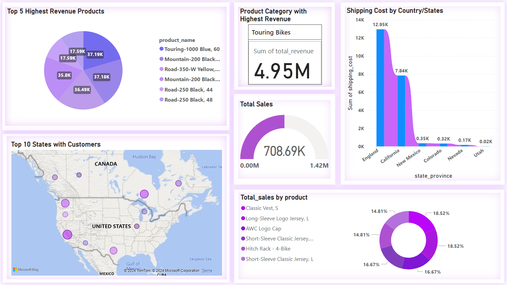

# Azure End to End Data Engineering Project (Customer Demographics)
## Customer Demographics Analysis and KPI Dashboard

## Overview
This project addresses a business request to analyze customer demographics and generate insights into sales performance segmented by gender and product categories. The solution involves building a robust data pipeline to extract, transform, and load (ETL) data from an on-premises SQL database into Azure, followed by the creation of a comprehensive KPI dashboard using Power BI.

## Architecture


The architecture leverages Azure services to ensure scalability, security, and efficient data processing. The key components include:
- **On-Premises SQL Database:** The source of customer and sales data.
- **Azure Data Factory:** Used for orchestrating and automating data extraction and loading processes.
- **Azure Data Lake:** Acts as the centralized data storage in the cloud, structured in the Bronze, Silver, and Gold layers for efficient data processing.
- **Azure Databricks:** Handles data transformation and prepares the data for analytics.
- **Azure Synapse Analytics:** Serves as the data warehouse for querying and modeling the data.
- **Power BI:** Provides a user-friendly interface for creating and sharing dashboards.
- **Security & Governance:** Includes Azure Active Directory for authentication and Key Vaults for secure credential management.


## Dashboard:




## Objectives
1. Provide actionable insights into:
   - Sales by gender.
   - Sales by product categories.
   - Total products sold and revenue.
   - Gender distribution among customers.
2. Enable filtering by product category, gender, and time periods.
3. Automate daily data pipeline execution to ensure stakeholders have access to up-to-date and accurate data.

## Repository Structure
```text
├── README.md          
├── azure_databricks_transformations/     
├── data_pipeline/  
├── dashboards/                    
└── docs/
└── SQL/ 
```

## Setup Instructions

### Prerequisites
- Azure subscription
- Power BI installed on your system
- Access to an on-premises SQL database
- Azure CLI installed locally (optional but recommended)

### Steps
#### Azure Data Factory Pipelines
1. **Extract Pipeline**:
   - Extracts data from the on-premises SQL database.
   - Stores raw data in the **Bronze layer** of Azure Data Lake.

2. **Transform Pipeline**:
   - Uses Databricks to clean and transform data.
   - Outputs refined data to the **Silver layer**.

3. **Load Pipeline**:
   - Loads curated data from the Gold layer into Synapse Analytics for analytics and reporting.

#### Synapse Pipelines
1. **KPI Calculation Pipeline**:
   - Runs SQL scripts to calculate aggregated metrics for Power BI dashboards.

## Key Features
- **Scalable Data Lake Architecture**: Organized into Bronze, Silver, and Gold layers for efficient data processing.
- **Automation**: Fully automated pipelines with daily triggers.
- **Security**: Integration with Azure Key Vault for secure credential management.
- **Interactivity**: Power BI dashboard enables dynamic filtering by gender, product category, and time periods.

## Usage Instructions

1. **Run the ADF Pipeline**:
   - Navigate to the Azure Data Factory portal.
   - Trigger the Pipeline to initiate data ingestion.

2. **Monitor Pipeline Runs**:
   - Use the **Monitor** tab in Azure Data Factory to track progress and debug issues.

3. **Access the Dashboard**:
   - Open the Power BI report file (`dashboards/Report_New.pbix`).
   - Update the data source connection to your Synapse Analytics instance.
   - Publish the dashboard to Power BI service for sharing with stakeholders.

