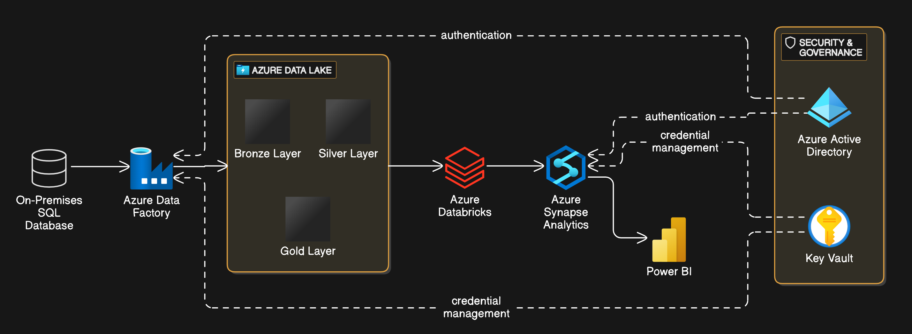

# Azure End to End Data Engineering Project (Customer Demographics)
## Customer Demographics Analysis and KPI Dashboard

## Overview
This project addresses a business request to analyze customer demographics and generate insights into sales performance segmented by gender and product categories. The solution involves building a robust data pipeline to extract, transform, and load (ETL) data from an on-premises SQL database into Azure, followed by the creation of a comprehensive KPI dashboard using Power BI.

## Architecture


The architecture leverages Azure services to ensure scalability, security, and efficient data processing. The key components include:
- **On-Premises SQL Database:** The source of customer and sales data.
- **Azure Data Factory:** Used for orchestrating and automating data extraction and loading processes.
- **Azure Data Lake:** Acts as the centralized data storage in the cloud, structured in the Bronze, Silver, and Gold layers for efficient data processing.
- **Azure Databricks:** Handles data transformation and prepares the data for analytics.
- **Azure Synapse Analytics:** Serves as the data warehouse for querying and modeling the data.
- **Power BI:** Provides a user-friendly interface for creating and sharing dashboards.
- **Security & Governance:** Includes Azure Active Directory for authentication and Key Vaults for secure credential management.


## Objectives
1. Provide actionable insights into:
   - Sales by gender.
   - Sales by product categories.
   - Total products sold and revenue.
   - Gender distribution among customers.
2. Enable filtering by product category, gender, and time periods.
3. Automate daily data pipeline execution to ensure stakeholders have access to up-to-date and accurate data.

## Repository Structure
```text
├── README.md          
├── data_pipeline/     
├── transformations/   
├── dashboards/        
├── config/            
└── docs/              
